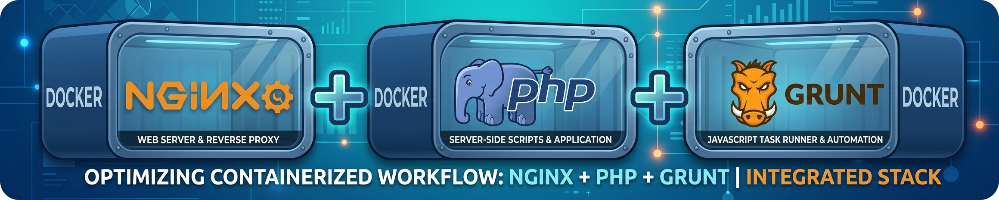

<!-- LOGO DEL PROYECTO -->


# Workbench Docker: Nginx + PHP-FPM + Node/Grunt

Entorno de desarrollo local, reproducible y aislado para proyectos web PHP. El stack está compuesto por tres contenedores Docker que trabajan sobre una red privada y comparten el código del sitio:

- **Nginx**: servidor web y proxy inverso. Atiende HTTP/HTTPS, sirve los archivos estáticos y envía las peticiones PHP a PHP-FPM.
- **PHP-FPM**: ejecuta el código PHP de la aplicación. Utiliza PHP 8.2 sobre Debian Bookworm e incluye OPcache.
- **Node.js + Grunt**: entorno de automatización frontend. Minifica CSS y JavaScript, concatena y optimiza archivos PHP, y observa los archivos fuente para regenerar los artefactos durante el desarrollo.

El sitio se publica con el dominio local `test.local`. La configuración de
Nginx redirige HTTP a HTTPS y utiliza un certificado autofirmado incluido en
`resources/01-nginx/include/Certificado-autofirmado/`.

## Arquitectura

```text
Navegador
   │
   │ https://test.local (puertos 80/443)
   ▼
┌──────────────────────┐
│ 01-nginx             │  (contenedor Debian)
│ Nginx + SSL          │  
└──────────┬───────────┘
           │ FastCGI :9000
           ▼
┌──────────────────────┐
│ 02-php               │  (contenedor Debian)
│ PHP-FPM 8.2          │  
└──────────────────────┘
        ./www/
           ▲
           | genera archivos en el volumen compartido
┌──────────┴───────────┐
│ 09-node-grunt        │  (contenedor Alpine)
│ Node.js + Grunt      │ 
└──────────────────────┘

```

Los tres servicios se conectan a la red Docker `00-net-devel-01`. Nginx y PHP
comparten `./www`, mientras que el contenedor de Node/Grunt comparte
`./sources`, `./www`, `Gruntfile.js` y los archivos de npm.

## Requisitos

- Docker Engine
- Docker Compose v2 (`docker compose`)
- `make` (opcional, para usar los comandos del `Makefile` incluido)
- Una entrada local para `test.local` en `/etc/hosts`:

  ```text
  127.0.0.1 test.local www.test.local
  ```

El navegador mostrará una advertencia la primera vez que se visite el sitio,
porque el certificado HTTPS es **autofirmado**.

## Puesta en marcha

Desde este directorio:
```bash
docker compose up -d --build
```

o usando el **Makefile**
```bash
make bake
```


Abrir [https://test.local](https://test.local) y aceptar la excepción del
certificado de desarrollo si el navegador la solicita.

Para detener el entorno:

```bash
docker compose down
```

También se puede utilizar:

```bash
make bake    # Construye y levanta el stack usando Compose Bake
make rerun   # Detiene y vuelve a iniciar los contenedores
make rebuild # Reconstruye las imágenes desde cero
make help    # Muestra los comandos disponibles
```

## Flujo de assets con Grunt

Los archivos editables se encuentran en `sources/`. El contenedor
`09-node-grunt` ejecuta la tarea predeterminada de Grunt al iniciar y luego
mantiene activo el modo `watch`.

| Origen | Salida en `./www/` | Procesamiento |
| --- | --- | --- |
| `sources/CSS/*.css` | `_test.min.css` y su mapa | Minificación con `cssmin` |
| `sources/JS/*.js` | `_test.min.js` y su mapa | Concatenación/minificación con `uglify` |
| `sources/PHP-functions/*.php` | `_functions.php` | Limpieza y concatenación |
| `sources/PHP-classes/*.php` | `_classes/` | Limpieza  |
| `sources/PHP-scripts/*.php` | `_scripts/` | Limpieza  |

Para ejecutar una compilación puntual dentro del contenedor:

```bash
docker exec -it 09-node-grunt sh
cd /workdir
grunt build
```

La tarea `grunt build` genera los archivos una vez. La tarea predeterminada
(`grunt`) además activa la observación de cambios.

## Estructura principal

```text
.
├── docker-compose.yaml         # Orquestación de los tres servicios
├── Dockerfile.01-nginx         # Imagen del servidor web
├── Dockerfile.02-php           # Imagen de PHP-FPM
├── Dockerfile.09-node-grunt    # Imagen de Node.js y Grunt
├── Gruntfile.js                # Pipeline de minificación y concatenación
├── sources/                    # Código fuente editable
├── www/                        # Document root y archivos generados
├── resources/                  # Configuración, certificados y plantillas
├── vol-01-var-log-nginx/       # Logs del servidor Nginx [^1]
├── vol-02-var-log-php/         # Logs del runtime de PHP [^1]
├── vol-x-01-nginx-conf.d/      # Configuración del virtual host de Nginx
└── Makefile                    # Atajos para operaciones Docker
```

[^1]: Los logs se montan en `vol-01-var-log-nginx/` y `vol-02-var-log-php/`. Estos
directorios se crean al levantar los servicios y están excluidos del control
de versiones.

## Acceso a los contenedores

```bash
docker exec -it 01-nginx bash
docker exec -it 02-php bash
docker exec -it 09-node-grunt bash
```

## Notas de seguridad

Este repositorio está pensado para **desarrollo local**. Antes de utilizarlo en
producción:

- Sustituir el certificado autofirmado por certificados gestionados
  correctamente.
- Revisar los secretos y archivos `.htpasswd` antes de publicarlos.
- Ajustar los niveles de log y la configuración de PHP/Nginx.
- No exponer directamente los puertos ni la red de desarrollo sin una capa de
  seguridad adicional.


## Autor :
**Pedro Javier Acosta**
- GitHub: 	[github.com/peteracosta](https://github.com/peteracosta)
- LinkedIn: [linkedin.com/in/acosta-peter](https://linkedin.com/in/acosta-peter)

