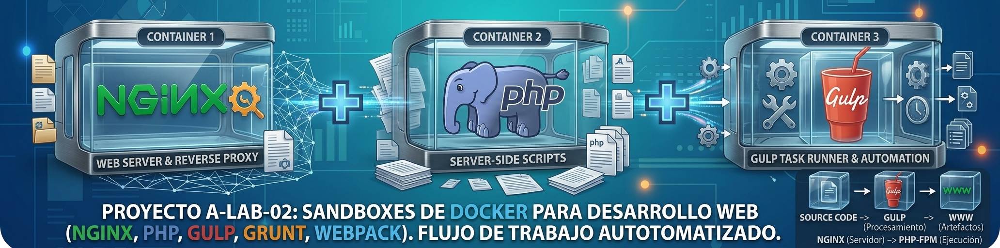

# A-Lab-02: Docker Web Development Sandboxes

Repositorio de estudio y experimentación para construir entornos de desarrollo
web reproducibles con Docker. Aquí se reúnen varios *sandboxes* que exploran
distintas combinaciones de servidor web, backend PHP y herramientas modernas
para procesar los recursos frontend.

El objetivo no es ofrecer una plantilla de producción, sino un **laboratorio
práctico** en el que se pueda observar cómo se organizan, conectan y
comunican varios contenedores para formar un stack web completo.

## Stack común

Cada sandbox parte de una arquitectura de tres servicios Docker:

```text
Navegador
    │
    │ HTTP/HTTPS
    ▼
┌─────────────────────────────┐
│ Nginx                       │  (contenedor Debian)
│ Servidor web y proxy        │
│ inverso / FastCGI           │
└──────────────┬──────────────┘
               │ peticiones PHP
               ▼
┌─────────────────────────────┐
│ PHP-FPM                     │  (contenedor Debian)
│ Ejecución del backend PHP   │
└─────────────────────────────┘
               ▲
               │ archivos procesados
               │
┌──────────────┴──────────────┐
│ Node.js + task runner       │  (contenedor Alpine/Debian)
│ Gulp, Grunt o Webpack       │
└─────────────────────────────┘
```

- **Nginx** funciona como servidor web, entrega archivos estáticos y actúa
  como proxy inverso hacia PHP-FPM mediante FastCGI.
- **PHP-FPM** ejecuta el código del backend PHP en un contenedor aislado.
- **Node.js** aloja las herramientas de automatización. Según el sandbox,
  Gulp, Grunt o Webpack concatenan, limpian y minifican archivos CSS y
  JavaScript; algunos flujos también preparan archivos PHP.

Los servicios se conectan mediante una red Docker privada y comparten los
directorios necesarios. El código editable se mantiene separado de los
artefactos generados: normalmente se trabaja en `sources/` y el resultado se
publica en `www/`, que es el document root utilizado por Nginx y PHP-FPM.


## Sandboxes incluidos

Cada carpeta contiene un experimento autónomo con su propio `docker-compose.yaml`,
Dockerfiles, configuración y documentación.

[`01-sandbox-nginx-php-grunt`](./01-sandbox-nginx-php-grunt/):
Primer stack con **Nginx**, **PHP-FPM** y **Node.js + Grunt**. Incluye tareas para concatenar y minificar recursos y un modo `watch` para desarrollo.

[`02-sandbox-nginx-php-webpack`](./02-sandbox-nginx-php-webpack/):
Variante del stack anterior que utiliza **Webpack** para organizar y optimizar los recursos del frontend.

[`03-sandbox-nginx-php-gulp-npm`](./03-sandbox-nginx-php-gulp-npm/):
Stack con **Node.js** + **Gulp**, administrado mediante **NPM**, para procesar CSS, JavaScript, HTML y partes reutilizables de PHP.

[`05-sandbox-Grid-CSS`](./05-sandbox-Grid-CSS/):
Entorno de práctica centrado en ejemplos y experimentos de **CSS Grid**, integrado con Nginx, PHP-FPM y Gulp.


## Flujo de trabajo

1. Elegir uno de los sandboxes y entrar en su directorio.
2. Revisar su README para conocer los servicios, puertos, volúmenes y
   comandos específicos.
3. Editar el código fuente en `sources/`.
4. Dejar activo el contenedor de Node.js para que el task runner procese los
   cambios automáticamente o ejecutar una compilación puntual.
5. Probar el resultado desde el navegador a través de Nginx.
6. Inspeccionar los archivos generados en `www/` sin editar manualmente los
   artefactos que el pipeline vuelve a crear.

## Requisitos generales

- Docker Engine.
- Docker Compose v2 (`docker compose`).
- GNU Make, opcional: algunos sandboxes incluyen un `Makefile` con atajos.
- Un navegador web.

Algunos entornos utilizan el dominio local `test.local` y HTTPS con un
certificado autofirmado. Cuando corresponda, hay que asociar el dominio a
`127.0.0.1` en `/etc/hosts` y aceptar la advertencia del navegador propia de
un certificado de desarrollo.

## Inicio rápido

Por ejemplo, para iniciar el sandbox de Grunt:

```bash
cd 01-sandbox-nginx-php-grunt
docker compose up -d --build
```

Para detener sus contenedores:

```bash
docker compose down
```

Los comandos exactos y las URLs de cada experimento pueden variar. Consulta
el README de la carpeta elegida antes de levantar otro stack.

## Qué se puede aprender

- Separación de responsabilidades entre servidor web, runtime backend y
  herramientas de build.
- Comunicación entre contenedores mediante redes Docker.
- Uso de volúmenes compartidos para separar fuentes y artefactos.
- Configuración de Nginx como proxy inverso y gateway FastCGI.
- Automatización de tareas repetitivas con Gulp, Grunt y Webpack.
- Comparación de gestores de paquetes y pipelines de transformación de
  recursos.
- Organización de un entorno local reproducible para experimentar sin
  instalar todo el stack directamente en el sistema anfitrión.

## Alcance y seguridad

Este repositorio está pensado para **desarrollo local y aprendizaje**. Sus
certificados autofirmados, configuraciones de red y valores por defecto **no
deben trasladarse a producción** sin una revisión completa. Para un despliegue
real sería necesario configurar certificados válidos, secretos seguros,
permisos adecuados, logs, límites de recursos y una política de exposición de
puertos.

## Autor

**Pedro Javier Acosta**

- GitHub: [github.com/peteracosta](https://github.com/peteracosta)
- LinkedIn: [linkedin.com/in/acosta-peter](https://linkedin.com/in/acosta-peter)
